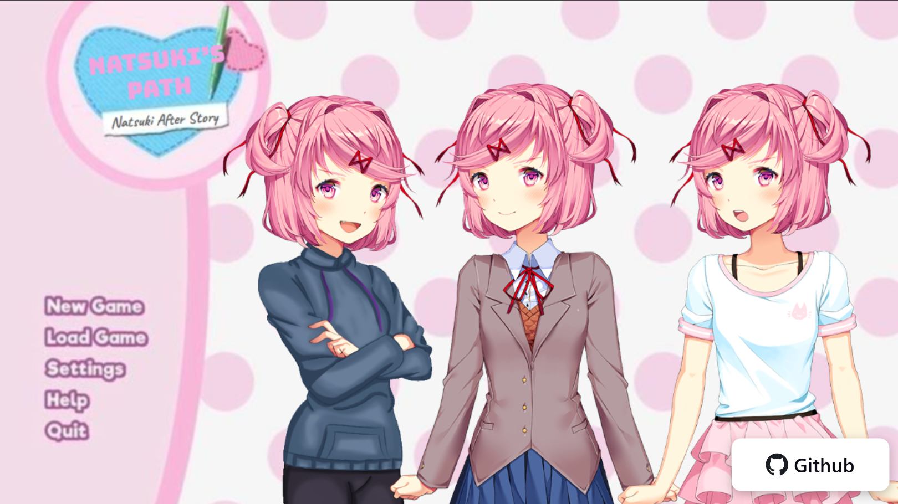
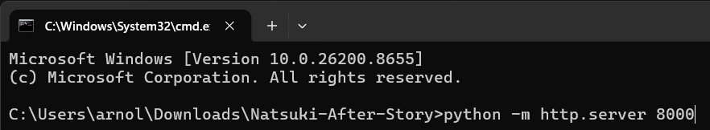
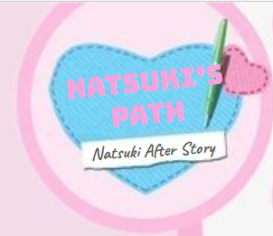

Natsuki After Story
=====================

How to run
----------
Open `index.html` locally in your browser, or play the hosted game at
https://rozeidk.github.io/Natsuki-After-Story/.

If the GitHub Pages version is not working, you can use the Cloudflare Pages version:
https://natsuki-after-story.botroze102.workers.dev/
Note that this version may not include the latest updates from the repository.

Want the latest features and the most complete experience? Try the Netlify version:
https://natsuki-after-story.netlify.app/
This build includes the full game and all enhancements, including the special Cloudflare version features.

How to play
-----------
- Click or tap to advance dialogue and scenes.
- Make choices with the on-screen buttons when they appear.
- Audio and images load from the `assets/` folder.

Project files
-------------
- `index.html` — game entry point and HTML UI.
- `runtime.js` — game runtime/engine logic.
- `game.json` — story data and scene definitions.
- `styles.css` — visual styles.
- `assets/` — images, audio, and other media used by the game.

Screenshots
-----------

Contributing
------------
Improvements and fixes are welcome. If this project is hosted in a version-controlled
repository, please open a pull request or issue describing your changes.

Credits
-------
Natsuki After Story is a fan-made mod for Doki Doki Literature Club (DDLC).
All original game assets and copyrights belong to Team Salvato.

Natsuki After Story uses Doki Doki Dialog Generator to make backgrounds and dialog.
You can access Doki Doki Dialog Generator at https://edave64.github.io/Doki-Doki-Dialog-Generator/release/

Credits:
- Team Salvato
- Dan Salvato
- edave64

Contact
-------
For questions or suggestions, please open an issue in the repository.

Other After Stories
-------------------
- Monika After Story(Browser) - Coming Soon

- Sayori After Story(Browser) - Coming Soon

- Yuri After Story (Browser) - Coming soon
